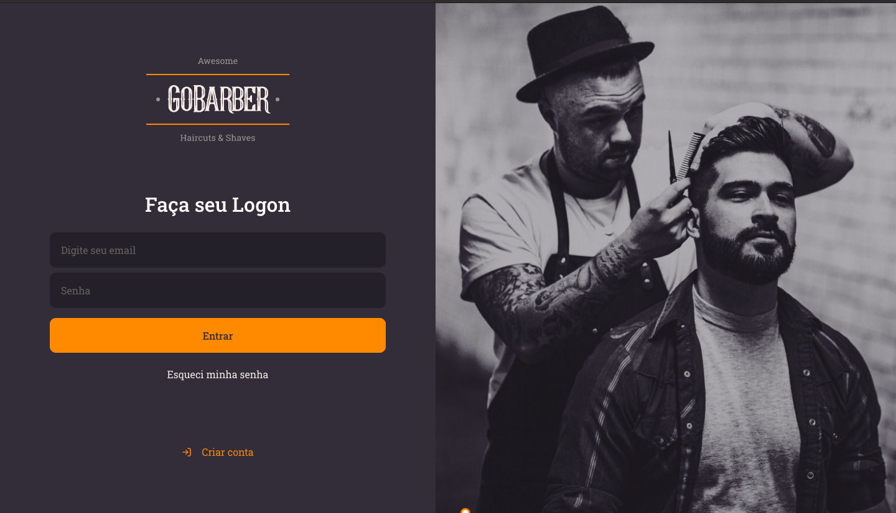

<h3 align="center">
  GoBarber 2.0
</h3>

<h1 align="center">
  
</h1>

This project was build during GoStack bootcamp of Rocketseat using React and Node.js with TypeScript.

<blockquote align="center">“Não espere para plantar, apenas tenha paciência para colher”!(Rocketseat, 2020)</blockquote>

---

For some questions, send me an email. =] (tiagohenriquequeiroz@gmail.com)
